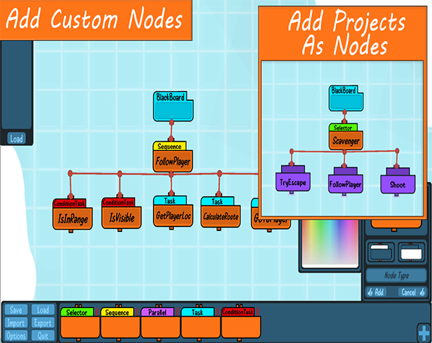

# BehaviorTreePlanner
 
I made this as a first project to learn unity UI.
You can use it if you have a pure code behavior tree without an interface and you want a way to visualise it before writing it.

This work is licensed under a
Creative Commons Attribution-NonCommercial-ShareAlike 4.0 International License

